# Formation sur les GAN 
    Octobre 2022
    By Samuel Sithakoul

## Introduction

Les GAN (prononcez G-A-N-E s'il vous plaît et pas comme gant :expressionless:) c'est quoi me diriez-vous? Comme son nom l'indique, ça sert à générer des machins. Bah oui GAN comme Generative Adversial Network ou Réseau Antagoniste Génératif (ne dites pas RAG non plus :angry:). 

Et qu'est-ce que ça génère au juste ? Essentiellement des images mais aussi de la musique, des vidéos, des séries temporelles (même si en vrai on n'utilise pas ça). On peut aussi faire du `image2image` translation qui consiste à transformer une image d'un domaine en une image d'un autre domaine (du genre transformer un cheval en zèbre) ou du `text2image` translation où on transforme une requête textuelle en une image (vous avez peut-être entendu parler de DALL-E 2 récemment qui fait ça même s'il utilise un autre modèle de génération qui n'est pas un GAN). 

Ce qui a fait le plus parler des GANs c'est surtout la génération de visages ultra-réalistes avec StyleGAN en 2018 puis ses enfants StyleGAN2 et StyleGAN3 qui ont permis de pousser vraiment loin la génération d'images. 

Maintenant que tout ça est dit, voyons un peu plus en détail à quoi ressemble notre ami le GAN...
## 1) Principe d'un GAN

### Problème
Pour formaliser un tout petit peu notre problème, on va considérer qu'on veut générer des images `réelles` qui suivent une certaine distribution de probabilité disons $p_{x}$. Ensuite on va dire que nos images générées appartiennent à une distribution $p_{g}$. Toutes ces images sont de taille $W \times H \times$ nb de canaux (3 canaux RGB ou 1 canal noir/blanc). Notre GAN va alors faire une correspondance entre du bruit qui appartient à ce qu'on appelle l'espace latent et l'espace des images. L'espace latent correspond à un ensemble de vecteurs aléatoires, disons de $\mathbb{R}^{100}$ suivant une distribution $p_{z}$ (uniforme ou normale souvent). L'objectif, c'est alors de faire coïncider $p_{g}$ avec $p_{x}$ en faisant "correctement" cette correspondance entre l'espace latent vers les images.
<p align="center">
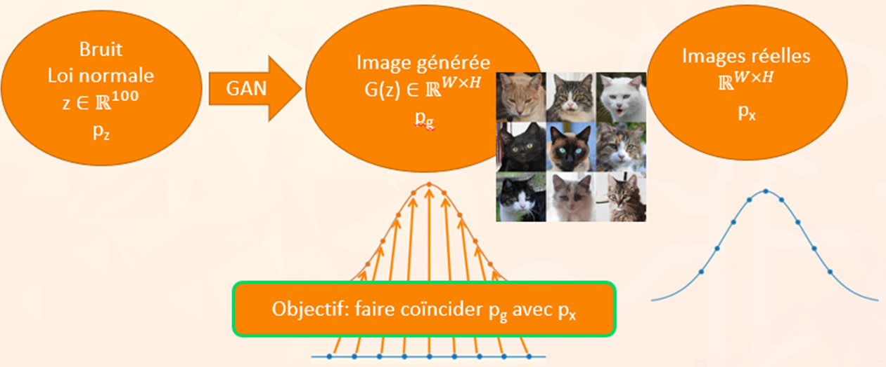
</p>
Bon ensuite on va dire qu'on a un générateur qui est censé faire cette correspondance, reste à savoir quel critère on utilise pour dire que l'image générée est bonne. Comment faire comprendre au générateur la différence entre un gribouilli tout moche et des vraies images? 

### Réponse
Idée simple :disappointed: : on prend l'écart pixel par pixel entre les deux images (MSE ou valeur absolue peu importe). Spoiler alert: ça ne marche pas parce que bon ce serait trop simple sinon. En vrai, c'est surtout parce qu'avec ce critère on obtiendrait juste des copies des images réelles et on ne reproduirait pas le "style" ou l'essence de l'ensemble des images (on ne pourra pas approcher la distribution des images réelles dans son ensemble).

Solution :yum:: Vu qu'on ne peut pas relier les deux distributions des images comme ça, il nous faut un moyen d'approximer les différences entre celles-ci. On ajoute donc un critique, plutôt appelé discriminateur dans notre cas qui va dire si une image est réaliste ou non. On lui donne à manger des images réelles et des images générées puis il nous sort une probabilité que l'image est vraie. 

Donc en gros on a 
$$ G: \mathbb{R}^{100} \rightarrow \mathbb{R}^{W \times H}$$ 
et $$ D: \mathbb{R}^{W \times H} \rightarrow [0,1]$$ 
(G comme générateur et D comme discriminateur bien sûr).

<p align="center">
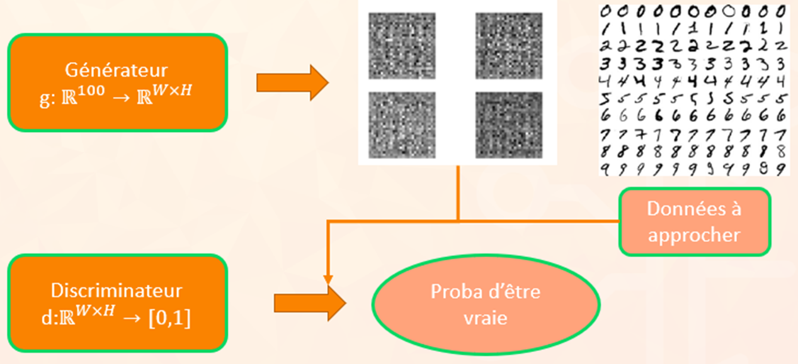
</p>
Ok ça y est on a nos deux compères qui vont s'associer pour s'améliorer mutuellement par le pouvoir de l'amitié. Mais au fait, c'est quoi concrètement ces deux-là. Bon si vous avez bien suivi c'est dans le nom, on veut approximer deux fonctions donc bim réseaux de neurones.

Super, maintenant regardons de plus près à quoi ressemblent nos deux réseaux !

## 2) En pratique

### El discriminator

Vu qu'on travaille sur des images, on va utiliser ces super réseaux que sont les CNN.:scream:

Le discriminateur, c'est juste un classifieur CNN classique. Il prend des images et sort un scalaire qui est la probabilité que l'image soit réelle. Il y a quand même quelques subtilités dans l'architecture car on va assembler des blocs de : 
```
Convolution -> Batch Normalization -> LeakyReLU
```

#### Leaky ReLU

Vous vous souvenez de notre fonction d'activation ReLU ? Bah la LeakyReLU c'est presque la même sauf que dans $\mathbb{R}^{-}$, au lieu d'avoir juste 0, on a $y=\alpha x$ avec $\alpha$ un petit nombre du genre 2e-2. Ça permet de faire en sorte que si on se trouve à gauche, les gradients sont non nuls et donc le modèle peut continuer à s'entraîner (problème de la `Dead ReLU`). On peut bien sûr essayer d'autres fonctions d'activations pour éviter ce problème mais les gradients de la LeakyReLU restent aussi efficaces à calculer que la ReLU.:thumbsup:
<p align="center">
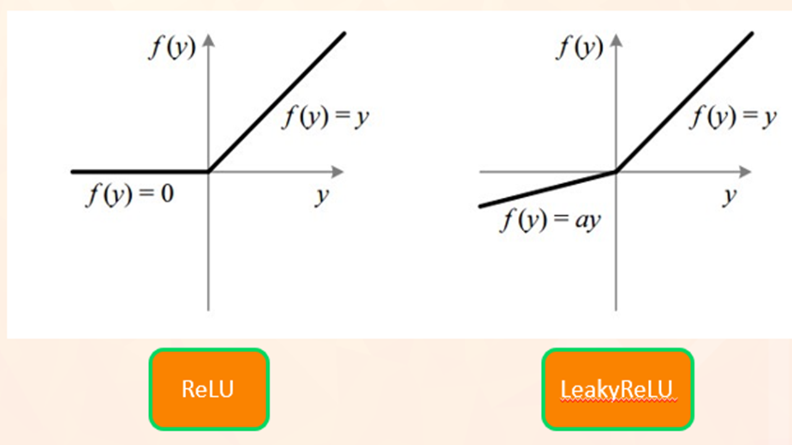
</p>

#### Batch Normalization

Avant d'appliquer notre activation à la couche de convolution, on ajoute souvent dans les GAN une couche dite de Batch Normalization. L'objectif est de normaliser les données après chaque couche pour faciliter l'entraînement du modèle. Concrètement, on calcule la moyenne $\mu$ du batch de données et sa variance $\sigma^{2}$ puis on fait 

$$x = \frac{x-\mu}{\sqrt{\sigma^{2}+\epsilon}}$$ 
et 
$$y = \alpha x + \beta$$ 
($\epsilon$ permet juste d'éviter de diviser par 0, $\alpha$ et $\beta$ sont des paramètres apprenables pour ajuster la BN)
<p align="center">
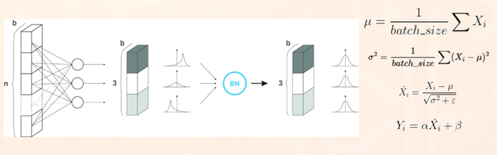
</p>
On se retrouve donc avec des données de moyenne nulle et de variance 1 ! A quoi ça sert de faire ça ? De un ça stabilise l'entraînement car chaque couche va pouvour s'adapter à des données sur une même plage :sunny: (on évite le covariate shift). De deux, on a ce qu'on appelle un Regularizer, les sorties de chaque couche sont liées aux statistiques (moyenne et variance) calculées sur un batch et donc en ajoutant ces informations à nos données, on évite les problèmes d'overfitting. C'est particulièrement intéressant ici où on le verra plus tard, les GAN sont assez instables et utiliser de la Batch Normalization aide à pallier ce problème.

### El generator

Le générateur, c'est un peu différent parce qu'on veut partir d'un vecteur puis "l'agrandir" assez pour avoir une image. Usuellement, on peut projeter le vecteur latent dans un espace de dimension supérieure pour le redimensionner en une petite image. 

Exemple : 
Vecteur latent de $\R^{100} \rightarrow$ Dense($4 \times 4 \times 1024$ neurones) $\rightarrow$ Image (4,4,1024). Ou juste $\R^{128} \rightarrow$ Image (4,4,8)

Après on travaille uniquement sur des images et on assemble des blocs de 
```
Convolution Transposée -> Batch Normalization -> ReLU
```

#### Convolution Transposée

Bon, c'est quoi maintenant cette couche mystèrieuse :confused: ? Je connais convolution mais pas transposée. Attention ce n'est pas l'opération inverse de la convolution au sens mathématique (à ne pas confondre avec déconvolution) ! 

<p align="center">

</p>

Ici le but, c'est d'agrandir la taille de l'image. Donc là il y a plusieurs étapes, ce n'est pas juste on applique le filtre :
- on calcule $z = s - 1$ avec $s$ le stride et $p'=k-p-1$ avec $k$ la taille du filtre et $p$ le padding
- on ajoute $z$ zéros entre les pixels et $p'$ zéros aux bords de l'image (quand je dis $n$ machins c'est $n$ couches, pas le nombre total de pixels)
- on applique notre filtre à cette image intermédiaire (convolution classique) et attention ici on ne touche plus à l'image donc pas de stride ou de padding à ce stade ! 

### Assembler tout

Une fois qu'on a notre générateur d'un côté et notre discriminateur de l'autre, on peut les mettre côte à côte et ça fait un GAN ! Attention à quand même avoir la même taille d'image au milieu bien sûr.
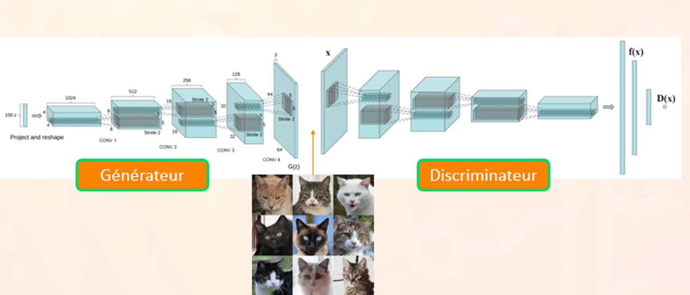

## 3) Entraînement :mountain_bicyclist:

Nos réseaux sont en places, chacun sur son côté du ring, le combat peut commencer... enfin l'entraînement.
On se souvient que pour entraîner un réseau de neurones, on a besoin du réseau évidemment et d'une loss à optimiser par descente du gradient et backpropagation.
Ici la loss est prise à la sortie du discriminateur et non du générateur, il s'agit tout simplement d'une Binary crossentropy (Crossentropy binaire vu qu'on travaille sur une prédiction 0 ou 1) donnée par la formule:

$$L(p(y_{i}),y_{i})=\frac{1}{N} \sum_{i=1}^{N} y_{i} \cdot log(p(y_{i})) + (1-y_{i}) \cdot log(1-p(y_{i}))$$
où $y_{i}$ est l'entrée du modèle et $p_{i}$ la prédiction sur cette entrée.

En fait on a plutôt un signe - si on veut minimiser cette fonction avec un réseau de neurones.
Ensuite, on doit entraîner chacun des deux réseaux à leur manière même si l'apprentissage doit bien être simultané.

### Entraînement du discriminateur

Pour récapituler, le discriminateur prend en entrée des images générées par le générateur qui ici n'apprend pas, on met ses poids en "pause" et des images réelles provenant du dataset. Son objectif est de prédire au mieux possible si les images qu'il reçoit sont vraies ou fausses.
En reprenant la notation précédente, on cherche alors à maximiser 
$$L(D(x),1)+L(D(G(z)),0)$$ 
où $x$ est une image réelle et $z$ un vecteur latent.
On a donc cette formule:
$$\frac{1}{m} \sum_{i=1}^{m} [log(D(x_{i})) + log(1-D(G(z_{i})))]$$

Pourquoi on cherche à maximiser ce truc? 

Déjà cette fonction de coût est à valeurs dans $]-\infty,0]$ pour $x \in [0,1]$. Donc si $D(x)$ est proche de 1 (on a bien prédit qu'une image réelle est réelle), $log(D(x))$ est proche de 0 donc maximale. 

De même si $D(G(z))$ est proche de 0 (on a bien prédit qu'une image générée est fausse), $log(1-D(G(z)))$ est proche de 0 donc maximale. Donc c'est normal qu'on doive maximiser cette fonction si on veut atteindre l'objectif voulu.

Ensuite, on a plus qu'à mettre à jour les poids du discriminateur et lui uniquement par calcul des gradients + backpropagation.

<p align="center">
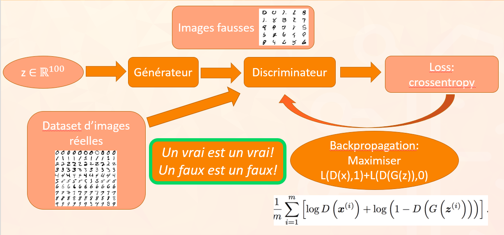
</p>

### Entraînement du générateur

Pour le générateur, on met de côté les images réelles, il n'en a pas besoin pour s'entraîner vu que son seul objectif est de générer de bonnes images. C'est le discriminateur qui va différencier vrai et faux.

Ici, on demande donc au générateur de créer des images puis le discriminateur va dire si elles sont réalistes ou pas. Attention, ce n'est pas parce que l'on entraîne le générateur qu'on a plus besoin du discriminateur. Cependant, les poids de ce dernier sont eux aussi mis en "pause". 

La fonction que l'on va chercher à minimiser est
$$L(D(G(z)),0)$$
ce qui donne la formule 
$$\frac{1}{m} \sum_{i=1}^{m}log(1-D(G(z_{i})))$$
Dans ce cas de figure, on cherche à tromper le discriminateur i.e. faire en sorte que s'il prédit que l'image est fausse, c'est une erreur, elle est bien vraie alors qu'elle ne l'est pas.

Voyons comment ceci se représente dans l'objectif de minimisation:

Si $D(G(z))$ est loin de 0 (donc 1 i.e. image réelle), alors $log(1-D(G(z)))$ est environ $-\infty$ donc minimale. Donc plus on s'éloigne de 0, c'est-à-dire de dire que l'image est fausse, plus la fonction est "petite".

On peut aussi plutôt maximiser 
$$L(D(G(z)),1)$$
i.e.
$$\frac{1}{m} \sum_{i=1}^{m}log(D(G(z_{i})))$$
L'objectif est alors de faire dire au discriminateur qu'une image générée est vraie. 

Dans la fonction, on voit bien ça si $D(G(z))$ est proche de 1, alors $log(D(G(z)))$ est proche de 0 donc maximale. 

Avec l'un ou l'autre de ces objectifs, on peut alors entraîner le générateur en remontant les gradients à travers le discriminateur (sans changer ses poids) et en mettant les poids du générateur à jour.
<p align="center">
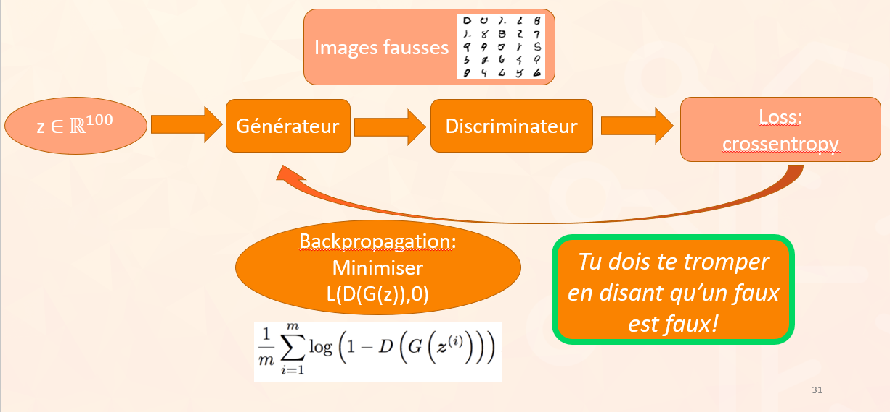
</p>

### Récap

On peut résumer l'objectif d'entraînement du GAN par la formule suivante:
$$\underset{G}{min} \underset{D}{max} L(D,G) = \mathbb{E}_{x \sim p_{data}(x)} [log D(x)] + \mathbb{E}_{z \sim p_z(z)} [log (1-D(G(z)))]$$

Les deux réseaux cherchent donc à maximiser ou minimiser la même fonction de coût, on remarque donc déjà des objectifs opposés et on sent qu'il va falloir trouver un bon équilibre entre les deux. 

Au cas où si vous vous demandez pourquoi il y a le $x$ réel ici même si on entraîne le générateur qui n'en a pas besoin, tout simplement on ignore ce terme et on garde alors que le terme de droite qui correspond bien à la loss du générateur.

## 4) Pourquoi ça marche ?

Dans cette section, on va voir à peu près comment on peut interpréter mathématiquement la loss utilisée pour un GAN classique et quelques résultats théoriques. 

Pour plus de détails sur les preuves, vous pouvez consulter ce [blog](https://lilianweng.github.io/posts/2017-08-20-gan/) qui introduit aussi le WGAN qui cherche à améliorer certains problèmes des DCGAN (ceux vu ici).

### KL/JS

Dans la première partie, on a vu que l'objectif du GAN était de faire correspondre la distribution d'images générées $p_{g}$ avec la distribution réelle $p_{data}$. Tout d'abord, il existe plusieurs moyens de quantifier la dissimilarité entre ces distributions dont la Kullback-Leibler Divergence qui va nous intéresser ici.

La KL divergence, on peut la résumer par cette formule :
$$D_{KL}(p||q) = \int_{x}p(x)log \frac{p(x)}{q(x)} dx$$
Le plus important reste de voir graphiquement ce qu'elle veut dire:
<p align="center">
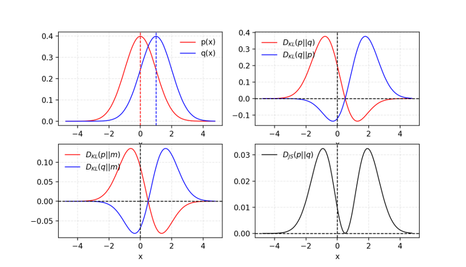
</p>
Quand les deux distributions sont très similaires, cette divergence est nulle et si au contraire elles sont très différentes, cette divergence est plus élevée. 

Attention: la KL divergence n'est pas symétrique, donc on a toujours une distribution **par rapport** à une autre.

Néanmoins dans notre problème, peu nous importe si c'est $p_{g}$ par rapport à $p_{data}$ ou $p_{data}$ par rapport à $p_{g}$ donc on va plutôt utiliser une version symétrique de cette divergence qui est la Jensen-Shannon Divergence. En plus la KL divergence peut-être infinie si une des deux distributions est nulle et l'autre non, pas super cool. 

Elle est définie comme:
$$D_{JS}(p||q) = \frac{1}{2} D_{KL}(p||\frac{p+q}{2})+\frac{1}{2} D_{KL}(q||\frac{p+q}{2})$$

Voilà on a désormais une manière de mesurer l'écart entre deux distributions et en plus sans asymétrie.

### Quelques preuves

Revenons à notre ami le GAN, on se souvient que l'objectif d'entraînement est donné par :
$$\underset{G}{min} \underset{D}{max} L(D,G) = \mathbb{E}_{x \sim p_{data}(x)} [log D(x)] + \mathbb{E}_{z \sim p_z(z)} [log (1-D(G(z)))]$$

que l'on peut réécrire:

$$\underset{G}{min} \underset{D}{max} L(D,G) = \mathbb{E}_{x \sim p_{data}(x)} [log D(x)] + \mathbb{E}_{x \sim p_g(x)} [log (1-D(x))]$$
où au lieu de prendre $G(z)$ avec $z$ vecteur latent, on considère juste $x \sim p_{g}$. 

On peut réécrire les espérances en intégrale par formule de transfert :
$$L(G,D) = \int_{x}(p_{data}(x) log(D(x)) + p_g(x) log(1-D(x)))dx$$

On peut considérer qu'on a alors une fonction de D et il manque plus qu'à dériver ce machin pour trouver les extrema. Tout ça est bien intégrable, dérivable...etc c'est pas trop le point ici et on obtient une valeur de D qui maximise cette fonction:
$$D^{*}(x)=\frac{p_{data}(x)}{p_{data}(x)+p_g(x)}$$

Là on constate que dans le cas où le générateur est aussi optimal, c'est-à-dire qu'il reproduise bien les images réelles et donc que $p_{g}=p_{data}$:
$$D^{*}(x)=\frac{1}{2} \: \textrm{et} \ L=-2log(2)$$ 

Or on peut aussi montrer que:
$$L(G,D*)=2D_{JS}(p_{data}||p_{g})-2log2$$

Et on constate que lorsque la $D_{JS}$ est nulle, on retrouve le résultat précédent. Ainsi la loss utilisé dans le GAN mesure la dissimilarité par JS Divergence entre $p_{data}$ et $p_{g}$ lorsque le discriminateur est optimal. 

Attention cela ne veut pas dire qu'il faut entraîner le discriminateur tout seul puis le générateur après, les deux ont besoin l'un de l'autre pour s'entraîner, ce qui nous amène à la partie suivante...

## 5) (Presque) que des problèmes

### En pratique, ça ne converge pas ouf :cry:
Reprenons (encore) l'objectif d'entraînement du GAN:
$$\underset{G}{min} \underset{D}{max} L(D,G) = \mathbb{E}_{x \sim p_{data}(x)} [log D(x)] + \mathbb{E}_{z \sim p_z(z)} [log (1-D(G(z)))]$$

On voit bien qu'il peut y avoir déjà un premier souci, c'est que G et D veulent optimiser la fonction de coût dans deux "directions" différentes. Ils ont dont des intérêts diamétralement opposés sans se soucier de ce que cherche à faire l'autre, on a donc possiblement un problème de convergence. 

<p align="center">
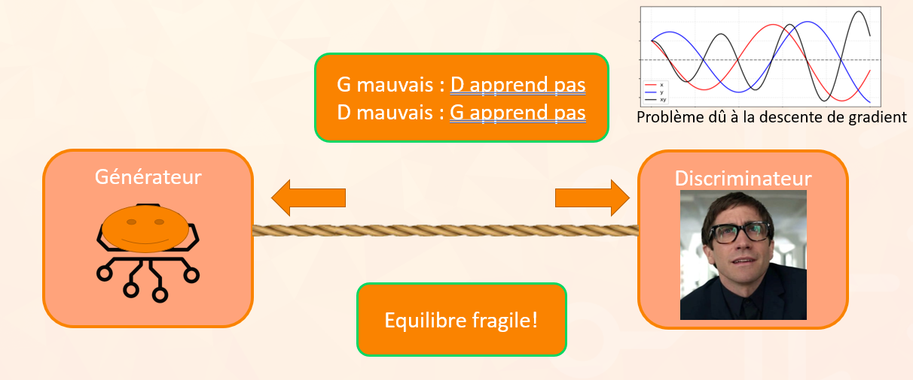
</p>

On peut voir ça tout simplement comme une relation prof/élève si on veut:
- Si le prof est mauvais (D), l'élève (G) n'apprend pas. Si D n'est pas bien entraîné, il va par exemple valider n'importe quelle image, même horrible, et G ne pourra pas s'améliorer puisque tout ce qu'il produit est reconnu d'office. 
- De même si l'élève est trop mauvais et ne fais aucun effort, le prof -on va dire qu'il débute- ne va pas pouvoir bien s'améliorer pédagogiquement. Si G produit que des échantillons de mauvaise qualité, D va toujours les rejeter et ne va pas réussir à s'améliorer aussi (il peut aussi devenir trop fort mais ça c'est la partie suivante)
- On a ensuite un cercle vicieux où si G ou D est mauvais l'autre va l'être aussi, ce qui va le rendre encore plus mauvais...etc 

Dans notre entraînement, on voit ça quand les loss de G et D n'arrêtent pas d'augmenter puis finissent par exploser (Exploding gradients). 

### Les gradients DISPARAISSENT :ghost:

Dans le cas où le discriminateur est optimal, on a 
$$D(x) = \left\{
    \begin{array}{ll} 
    1 & , \forall x \in p_{data} \\
    0 & , \forall x \in p_{g}
    \end{array}
\right.$$

Si on regarde notre fonction d'activation finale qui est une sigmoïde, on remarque que pour des valeurs proches de 1 ou 0, les gradients sont de plus en plus faibles. Cela signifie que lors de la backprop, on va faire remonter des gradients epsilonesques depuis la fin du réseau de neurones.
<p align="center">
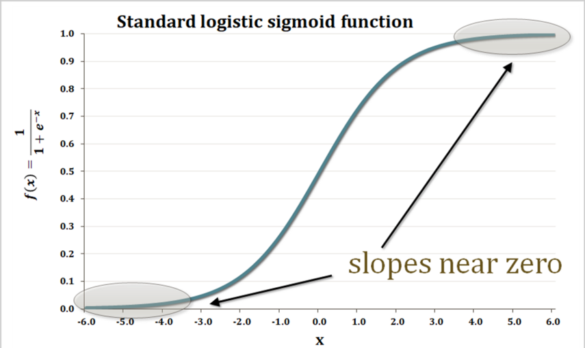
</p>
C'est très problématique pour les gros réseaux de neurones comme les GAN car avec la backprop, on propage de proche en proche une valeur quasi-nulle par multiplication de la règle de la chaîne. Donc plus on s'éloigne de la fin, plus les gradients sont faibles et le modèle ne s'entraîne plus. C'est surtout le cas du générateur qui est encore plus loin dans l'architecture donc on risque de ne pas réussir à générer de bonnes images.
<p align="center">
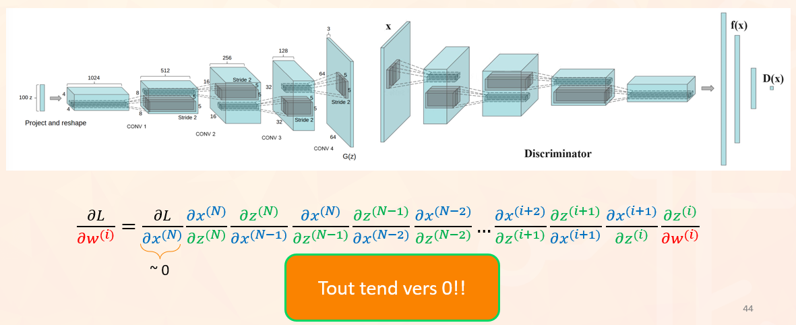
</p>

### Effondrement de modes :bomb:

Allez encore un dernier problème et on arrête de souffrir promis.

Le mode collapse (ou effondrement de modes) arrive quand G trouve un petit échantillon d'images qui trompe facilement D. Cet échantillon n'est cependant pas représentatif de la réalité donc on ne crie pas encore victoire. En effet, à cause de ça, le discriminateur va peut-être valider les images générées mais comme on a vu précédemment, ça ne va pas forcément aider le générateur à s'améliorer et il va continuer de tromper le discriminateur en boucle avec ces échantillons. 
<p align="center">
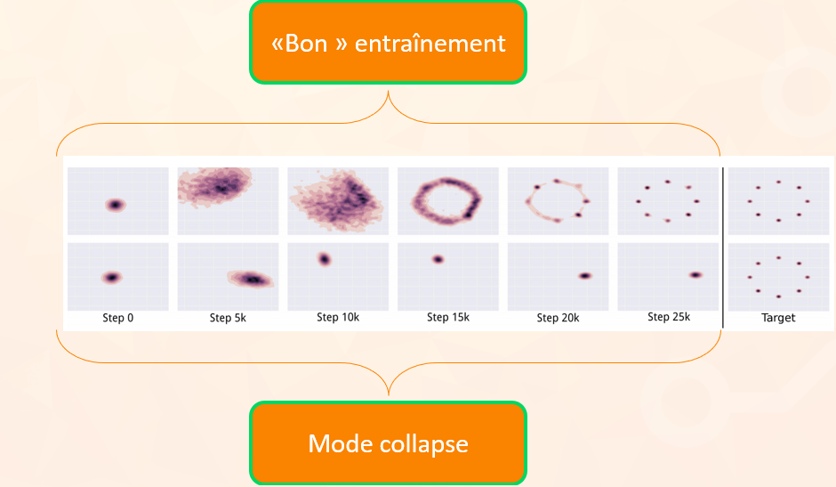
</p>
On peut alors se demander : mais il est con ou quoi le discriminateur ? Pourquoi il se laisse avoir tout le temps ?

Pas besoin d'insulter D (enfin pas trop) parce que D va sûrement remarquer qu'il y a un problème et le faire remarquer à G. Mais G est malin puisqu'il va générer un autre échantillon restreint d'images qui n'est pas le même que le précédent et continuer de tromper D sans produire d'images variées.

Exemple sur MNIST (les chiffres) : G génère que des 8, D est trompé au début puis remarque l'arnaque. Tant pis, G génère que des 7 maintenant... etc
<p align="center">
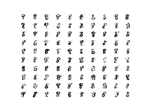
</p>
Résultat : on a un générateur qui ne reproduit pas la diversité du dataset réel et se concentre uniquement sur certaines parties de celui-ci. En plus, les images ne sont même pas assurées d'être de bonne qualité puisque le générateur ne va pas pouvoir s'entraîner correctement à reproduire l'entièreté de la distribution.

### Des solutions ? :heart:

Cette partie va surtout servir à donner quelques tips de manière non exhaustive pour entraîner un GAN et pallier un peu aux problèmes exposés précédemment.

- Normaliser les images dans [-1,1] : 
    on rappelle qu'une image RGB a pour dimension (longueur, largeur,3) et prend ses valeurs dans [0,255]. On peut alors normaliser les valeurs dans [0,1] puis dans [-1,1] par une transformation affine. Pour que les images générées aient aussi des valeurs dans [-1,1], on met une fonction d'activation en tangente hyperbolique à la fin du générateur (au lieu de linéaire pour [0,255] ou sigmoïde pour [0,1]).
   
    Pourquoi on fait ça ? Déjà en réduisant l'intervalle à [0,1], on fait en sorte de mettre en sortie du générateur une fonction d'activation bornée pas comme une activation linéaire car en pratique cela permet d'entraîner plus facilement le modèle. Et ensuite en passant dans [-1,1], on peut avoir des données de moyenne nulle, ce qui peut aider aussi à accélérer un peu l'apprentissage. La fonction d'activation tanh est aussi un peu mieux que la sigmoïde parce que ses gradients saturent un peu moins aux bords.
    <p align="center">
    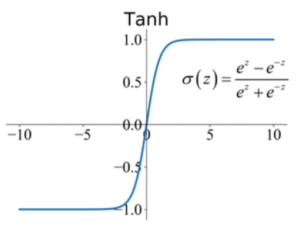
    </p>

- One-sided label smoothing: 
    ici c'est tout con, au lieu de chercher à prédire 1 pour les images réelles, on prédit 0.9 ou au moins $1 - \epsilon$ avec $\epsilon$ petit, voire aléatoire à chaque fois. 

    Pourquoi on fait ça? Parce qu'on a vu que les gradients sont faibles si le discriminateur est trop fort à cause de la sigmoïde à la fin. Mais si on prédit plutôt 0.9, on a des gradients un peu moins faibles donc on continue d'apprendre, cool ! Et on fait ça que d'un seul côté (one-sided), sinon on peut s'éloigner au contraire de l'objectif recherché:

    Si on remplace 1 par $\alpha$ et 0 par $\beta$, la valeur optimale pour le discriminateur devient
    $$D(x)=\frac{\alpha p_{\text {data }}(x)+\beta p_{\text {g}}(x)}{p_{\text {data }}(x)+p_{\text {g}}(x)}$$
    En effet, si on prend $\beta \neq 0$, de mauvais échantillons générés vont renforcer le comportement du générateur dans la mauvaise direction. Donc on fait ça que pour $\alpha$ et on laisse $\beta$ à 0.
    <p align="center">
    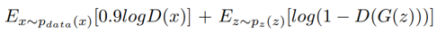
    </p>
- Ajouter labels: 
    on peut rajouter les classes des images en entrée du générateur et du discriminateur. En faisant ça, on conditionne l'entraînement avec plus d'informations donc ça aide l'entraînement et ça permet de lutter un peu contre le mode collapse. En plus, on peut alors contrôler ce que l'on génère directement au lieu d'avoir des images de classes aléatoires (même si on peut quand même contrôler les objets générés après coup par d'autres méthodes).
    <p align="center">
    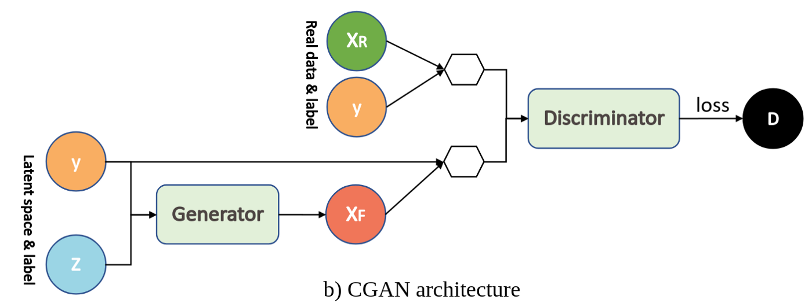
    </p>
- Feature matching: 
    on peut aussi ajouter un terme supplémentaire dans la loss qui correspond à la différence entre des features extraites par un modèle préentraîné (genre VGG): 
    $$\mid \mathbb{E}_{x \sim p_{\text {data }}} \mathbf{f}(\mathbf{x})-\mathbb{E}_{\mathbf{z} \sim p_{\mathbf{z}}(\mathbf{z})} \mathbf{f}(G(\mathbf{z})) \|_{2}^{2}$$
    Ainsi, on demande au modèle de faire aussi correspondre des caractéristiques de plus haut niveau entre le générateur et le discriminateur.

- WGAN:

    Le mode collapse c'est très relou parce que c'est pas évident à régler comme problème. Mais une nouvelle loss permet de nous aider, c'est la Wasserstein loss (d'où le  Wasserstein GAN). Le principe est qu'au lieu de se baser sur la JS-Divergence pour quantifier la dissimilarité entre les distributions, on va utiliser la Earth-Mover Distance (ou Wasserstein distance même) qui globalement représente le coût minimal de transport de masse d'une distribution à une autre. On peut voir ça comme le coût minimal de déplacer des boîtes d'une pile A à une pile B qui dépend de la masse de chaque boîte et de la distance de transport.

    On a alors la loss:
    <p align="center">
    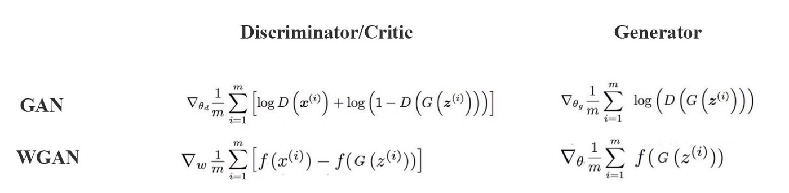
    </p>

    Ici le discriminateur devient ce qu'on appelle le "Critique" noté f, son rôle est différent car il attribue ici un score qui n'est plus binaire mais à valeur dans $\mathbb{R} $.
    Ce qu'il faut retenir c'est que la Wasserstein loss évite aux gradients de saturer comme pour le GAN "classique" et on arrive alors à avoir plus de diversité dans les échantillons générés.

## Ouverture :angel:

Liste non exhaustive de GANs intéressants:
- ProGAN: génération haute résolution
- StyleGAN 1,2,3: GAN qui a révolutionné la génération d'images HD avec des méthodes vraiment innovantes
- Conditional GAN: GAN avec les labels
- GauGAN : paired image2image translation
- CycleGAN : unpaired image2image translation... etc

Autres modèles génératifs:
- Variational Autoencoder VAE
- Flow-based models
- Diffusion models (à la mode en ce moment!)
